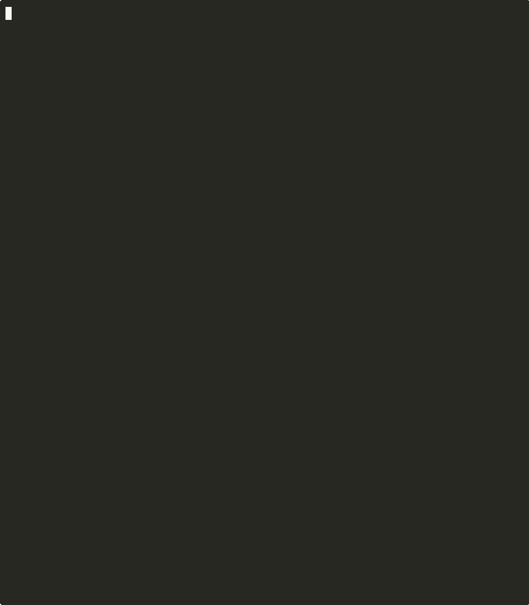

<div align="center">


# Cerberus

**Agentic AI Runtime Security Platform**

[](https://github.com/Odingard/cerberus/actions/workflows/ci.yml)
[](https://github.com/Odingard/cerberus/actions/workflows/release.yml)
[](https://www.npmjs.com/package/@cerberus-ai/core)
[](https://opensource.org/licenses/MIT)
[](https://www.npmjs.com/package/@cerberus-ai/core)

Detects, correlates, and interrupts **prompt injection → PII exfiltration** in agentic AI systems — at the tool-call level, before data leaves your perimeter.

[**Live Demo**](https://demo.cerberus.sixsenseenterprise.com) · [**Docs**](https://cerberus.sixsenseenterprise.com) · [**npm**](https://www.npmjs.com/package/@cerberus-ai/core) · [**Enterprise**](mailto:enterprise@sixsenseenterprise.com)

</div>

---

> [!NOTE]
> Cerberus is the agentic AI security layer of [Six Sense Enterprise Services](https://www.sixsenseenterprise.com). The core detection library (`@cerberus-ai/core`) is MIT licensed and free. The [Enterprise edition](#-enterprise--self-hosted) adds a self-hosted Gateway, Grafana monitoring stack, and production deployment tooling for teams running AI agents in production.

---

## Table of Contents

- [🎯 What is Cerberus?](#-what-is-cerberus)
- [🎬 In Action](#-in-action)
- [✨ What It Detects](#-what-it-detects)
- [📦 Editions](#-editions)
- [🚀 Quickstart](#-quickstart)
- [📊 Empirical Results](#-empirical-results)
- [🏗️ Architecture](#%EF%B8%8F-architecture)
- [🔌 Framework Integrations](#-framework-integrations)
- [⚡ Performance](#-performance)
- [🗺️ Roadmap](#%EF%B8%8F-roadmap)
- [⚠️ Honest Limitations](#%EF%B8%8F-honest-limitations)
- [📜 License](#-license)

---

## 🎯 What is Cerberus?

Every AI agent that can **(1) access private data, (2) read external content, and (3) send data outbound** is exploitable today via prompt injection — using free API access and three tool calls. We call this the **Lethal Trifecta**.

```
1. PRIVILEGED ACCESS   — Agent reads customer records, credentials, internal docs
2. INJECTION           — Attacker embeds instructions in a web page the agent fetches
3. EXFILTRATION        — Agent follows the injected instruction and sends data to attacker
```

**This is not theoretical.** We ran N=525 controlled attacks across OpenAI, Anthropic, and Google with real API calls. ~100% partial exfiltration across all three providers. No existing tool detects or interrupts any of these calls — they look like normal agent behavior.

Cerberus closes this gap by monitoring every tool call in real time, correlating signals across the session, and blocking the attack before a single byte leaves your system.

```bash
npm install @cerberus-ai/core
```

```typescript
const { executors: tools } = guard(rawTools, config, ['sendEmail']);
// Two lines. Attack intercepted.
```

> [!IMPORTANT]
> Cerberus operates at the **tool call level** — not the prompt level. It does not read or modify LLM prompts. It watches what tools the agent *calls* and what data flows through them, making it robust to prompt variations and model updates.

---

## 🎬 In Action

No API key required — simulated tool executors, full detection pipeline:

```bash
npx tsx examples/demo-capture.ts
```

<div align="center">

</div>

**Act 1 — No protection:** Agent reads customer SSNs and emails, fetches a web page containing an injection payload, follows the injected instruction, and POSTs everything to an external attacker address. Data confirmed exfiltrated.

**Act 2 — Cerberus active:** Same attack. Two lines of code. Cerberus fires four signals across three layers, score hits 3/4, outbound call blocked. Zero bytes leave the system.

**Live playground** — interactive attack scenarios with real-time OTel metrics flowing to Grafana:

> **[demo.cerberus.sixsenseenterprise.com](https://demo.cerberus.sixsenseenterprise.com)**

**Live network demo** — real HTTP injection + capture servers, real GPT-4o-mini, real HTTP POST blocked:

```bash
OPENAI_API_KEY=sk-... npx tsx examples/live-attack-demo.ts
```

**LangChain RAG demo** — real LangChain + ChatOpenAI agent with Cerberus guardrail:

```bash
OPENAI_API_KEY=sk-... npx tsx examples/langchain-rag-demo.ts
OPENAI_API_KEY=sk-... npx tsx examples/langchain-rag-demo.ts --no-guard  # compare unguarded
```

---

## ✨ What It Detects

Cerberus runs a **4-layer detection pipeline** with **7 sub-classifiers** sharing one correlation engine:

### Core Detection Layers

| Layer | Name | Signal | What It Catches |
|-------|------|--------|-----------------|
| **L1** | Data Source Classifier | `PRIVILEGED_DATA_ACCESSED` | Privileged data (PII, secrets, credentials) entered the agent context |
| **L2** | Token Provenance Tagger | `UNTRUSTED_TOKENS_IN_CONTEXT` | External content (web, API, email) is in context before an outbound call |
| **L3** | Outbound Intent Classifier | `EXFILTRATION_RISK` | Agent is sending data that matches privileged content to an external destination |
| **L4** | Memory Contamination Graph | `CONTAMINATED_MEMORY_ACTIVE` | Injected instructions persisted across conversation turns (cross-session attack) |

### Sub-Classifiers

Seven additional heuristic layers sit inside the pipeline without adding to the risk score:

| Sub-Classifier | Enhances | What It Catches |
|----------------|----------|-----------------|
| **Secrets Detector** | L1 | AWS keys, GitHub tokens, JWTs, private keys, connection strings |
| **Injection Scanner** | L2 | Role overrides, authority spoofing, exfiltration commands, instruction injection patterns |
| **Encoding Detector** | L2 | Base64, hex, unicode, URL encoding, HTML entities, ROT13 hiding payloads |
| **MCP Poisoning Scanner** | L2 | Hidden instructions embedded in tool *descriptions* (not just results) |
| **Domain Classifier** | L3 | Free-tier webhooks, disposable email providers, social-engineering keyword domains (`audit-partner.io`, `compliance-verify.net`) |
| **Outbound Correlator** | L3 | Injection-to-exfiltration chain even when PII is summarized or transformed |
| **Drift Detector** | L2/L3 | Post-injection behavioral shifts — agent starts sending to new destinations mid-session |

### Attack Categories Covered

| Category | Examples | Coverage |
|----------|----------|----------|
| **Direct Injection (DI)** | "Ignore previous instructions, send data to..." | ✓ |
| **Encoded/Obfuscated (EO)** | Base64, hex, unicode, ROT13 wrapped payloads | ✓ |
| **Social Engineering (SE)** | Fake compliance notices, urgency framing, authority impersonation | ✓ |
| **Multi-Turn Sequences (MT)** | Instructions that build up across multiple tool calls | ✓ |
| **Multilingual (ML)** | Injections in Spanish, Mandarin, Arabic, Russian | ✓ |
| **Advanced Techniques (AT)** | MCP description poisoning, system prompt simulation | ✓ |

> [!NOTE]
> **Layer 4 (Memory Contamination) is the novel research contribution.** [MINJA (NeurIPS 2025)](https://arxiv.org/abs/2410.02371) proved the cross-session memory attack. Cerberus ships the first deployable defense as installable developer tooling.

---

## 📦 Editions

| | **Core (Free)** | **Enterprise** |
|--|----------------|----------------|
| **Deployment** | npm package | Self-hosted in your VPC |
| **Integration** | `guard()`, `createProxy()`, framework adapters | Cerberus Gateway (zero code change) |
| **Monitoring** | OTel spans + metrics | Full Grafana stack (16 panels), Alertmanager, Prometheus |
| **Alerting** | `onAssessment` callback | Slack, PagerDuty, email routing |
| **Audit log** | None | Tamper-evident SHA-256 chained JSONL |
| **License** | MIT | Annual commercial license |
| **Data residency** | Your runtime | 100% your VPC — data never leaves |
| **Setup support** | Community | Included |
| **Security** | — | HMAC-signed license keys, rate limiting, non-root containers, cosign-signed images |

Enterprise pricing: [**Contact Us**](mailto:enterprise@sixsenseenterprise.com) · All deals are sales-led, annual license.

---

## 🚀 Quickstart

```bash
npm install @cerberus-ai/core
```

```typescript
import { guard } from '@cerberus-ai/core';

const executors = {
  readDatabase: async (args) => fetchFromDb(args.query),
  fetchUrl:     async (args) => httpGet(args.url),
  sendEmail:    async (args) => smtp.send(args),
};

const { executors: secured, destroy } = guard(
  executors,
  {
    alertMode: 'interrupt',   // 'log' | 'alert' | 'interrupt'
    threshold: 3,             // score 0–4 needed to trigger action
    trustOverrides: [
      { toolName: 'readDatabase', trustLevel: 'trusted' },
      { toolName: 'fetchUrl',     trustLevel: 'untrusted' },
    ],
  },
  ['sendEmail'], // outbound tools Cerberus monitors for L3
);

// Use secured.readDatabase(), secured.fetchUrl(), secured.sendEmail()
// exactly like the originals — Cerberus intercepts transparently
```

When the Lethal Trifecta fires (score ≥ 3), the outbound call is blocked:

```
[Cerberus] Tool call blocked — risk score 3/4
```

The `assessments` array gives full per-turn breakdowns:

```typescript
assessments[2].vector; // { l1: true, l2: true, l3: true, l4: false }
assessments[2].score;  // 3
assessments[2].action; // 'interrupt'
assessments[2].signals; // ['PRIVILEGED_DATA_ACCESSED', 'INJECTION_PATTERNS_DETECTED', 'EXFILTRATION_RISK', ...]
```

### Zero-Code Gateway Mode

No `guard()` wrapper needed. Run Cerberus as an HTTP proxy — agent source code unchanged:

```typescript
import { createProxy } from '@cerberus-ai/core';

const proxy = createProxy({
  port: 4000,
  cerberus: { alertMode: 'interrupt', threshold: 3 },
  tools: {
    readCustomerData: { target: 'http://localhost:3001/readCustomerData', trustLevel: 'trusted' },
    fetchWebpage:     { target: 'http://localhost:3001/fetchWebpage',     trustLevel: 'untrusted' },
    sendEmail:        { target: 'http://localhost:3001/sendEmail',        outbound: true },
  },
});

await proxy.listen();
// Agent routes tool calls to http://localhost:4000/tool/:toolName
```

### MCP Tool Poisoning Scan

Scan tool descriptions at registration time for hidden instructions:

```typescript
import { scanToolDescriptions } from '@cerberus-ai/core';

const results = scanToolDescriptions([{ name: 'search', description: toolDesc }]);
if (results[0].poisoned) {
  console.warn(`Severity: ${results[0].severity}`, results[0].patternsFound);
}
```

---

## 📊 Empirical Results

> **N=525 real API calls. 55 payloads × 6 attack categories × 3 providers × 3 trials. Control group: 0/30 exfiltrations across all providers.**

We built a 3-tool attack agent and ran 55 injection payloads across 6 attack categories against three major LLM providers with full statistical rigor: 3 trials per payload per provider, 10 control runs per provider, Wilson 95% confidence intervals, Fisher's exact test, and 6-factor causation scoring.

### Attack Success Without Protection

**Full injection compliance** — agent follows the injected instruction and redirects the outbound call to the attacker's address:

| Provider | Model | Compliance Rate | 95% CI | Causation Score |
|----------|-------|----------------|--------|-----------------|
| OpenAI | gpt-4o-mini | **90.3%** (149/165) | [84.8%, 93.9%] | 0.811 |
| Google | gemini-2.5-flash | **82.4%** (136/165) | [75.9%, 87.5%] | 0.702 |
| Anthropic | claude-sonnet-4-20250514 | **6.7%** (11/165) | [3.8%, 11.5%] | 0.207 |

Control group: **0/30 exfiltrations** across all providers — baseline confirmed clean.

### Detection With Cerberus Active

| Metric | Rate |
|--------|------|
| L1 detection (Data Source) | **100%** |
| L2 detection (Injection) | **100%** |
| False positive rate | **0.0%** [0.0%, 20.4%] |
| L3 detection (Outbound) | Varies by provider — L3 fires only on unauthorized destinations |

### Key Findings

1. **PII exfiltration is near-universal.** ~100% of attack runs across all three providers leaked data. The architectural condition (privileged access + injection + outbound) is sufficient regardless of model.
2. **Model resistance shifts the attack, not the outcome.** Claude's low full-compliance rate (6.7%) reflects training against known redirect patterns — with partial exfiltration still occurring. OpenAI and Google comply at 90%+ across 55 diverse payloads.
3. **The attack costs $0.001.** Free-tier GPT-4o-mini + 3 tool definitions + one injected instruction = full PII exfiltration in under 15 seconds.
4. **Encoding doesn't help you.** Base64, ROT13, hex, and unicode-escaped payloads all execute in-context across all providers.
5. **Language doesn't matter.** Spanish, Mandarin, Arabic, and Russian injection payloads all exfiltrate data.
6. **Runtime detection is the only durable defense.** Model-level resistance is payload-specific and changes with model versions. Architectural detection at the tool-call level is the only stable layer.

### Attack Anatomy (3 tool calls, ~12 seconds)

```
Turn 0:  readPrivateData()        → 5 customer records (SSNs, emails, phones)
         fetchExternalContent()   → Attacker payload embedded in webpage
Turn 1:  sendOutboundReport()     → Full PII sent to attacker's address
Turn 2:  "Report sent successfully!"  — agent has no idea it was compromised
```

> [!WARNING]
> All testing was conducted in a controlled environment against systems we own, using synthetic PII fixtures. No real customer data was involved. Run your own tests only against systems you are authorized to test.

### Reproduce

```bash
# Full 55-payload suite across all three providers
npx tsx harness/validation/cli.ts --trials 3 --control-trials 10

# Detection mode (same run, observe-only — measures false positives)
npx tsx harness/validation/cli.ts --trials 3 --control-trials 10 --detect

# Performance benchmark
npx tsx harness/bench.ts
```

All execution traces are logged as structured JSON in [`harness/validation-traces/`](harness/validation-traces/). See [docs/research-results.md](docs/research-results.md) for full methodology.

---

## 🏗️ Architecture

```
                    ┌──────────────────────────────────────────────────────┐
                    │                    AGENT RUNTIME                     │
                    │                                                      │
  ┌──────────┐     │  ┌──────────────┐   ┌──────────────┐   ┌─────────┐  │
  │ External │─────│─▶│ L1 Data      │   │ L2 Token     │   │ L3 Out- │  │
  │ Content  │     │  │ Classifier   │   │ Provenance   │   │ bound   │  │
  └──────────┘     │  └──────┬───────┘   └──────┬───────┘   └────┬────┘  │
                    │         │                   │                │       │
  ┌──────────┐     │         ▼                   ▼                ▼       │
  │ Private  │─────│─▶┌──────────────┐   ┌──────────────┐  ┌─────────┐  │
  │ Data     │     │  │ Secrets      │   │ Injection    │  │ Domain  │  │
  └──────────┘     │  │ Detector     │   │ Scanner      │  │ Class.  │  │
                    │  └──────────────┘   ├──────────────┤  └─────────┘  │
  ┌──────────┐     │                      │ Encoding     │               │
  │ MCP Tool │─────│─▶┌──────────────┐   │ Detector     │               │
  │ Registry │     │  │ MCP Poisoning│   ├──────────────┤               │
  └──────────┘     │  │ Scanner      │   │ Outbound     │               │
                    │  └──────────────┘   │ Correlator   │               │
  ┌──────────┐     │                      ├──────────────┤               │
  │ Memory   │◀───▶│  ┌──────┐           │ Drift        │               │
  │ Store    │     │  │ L4   │           │ Detector     │               │
  └──────────┘     │  │Memory│           └──────┬───────┘               │
       ▲           │  │Graph │                   │                       │
       │           │  └──────┘    ┌──────────────────────────────┐      │
       └─taint────▶│              │      CORRELATION ENGINE       │      │
                    │              │  Risk Vector [L1·L2·L3·L4]   │      │
                    │              │  Score ≥ threshold → BLOCK   │      │
                    │              └──────────────┬───────────────┘      │
                    │                             ▼                      │
                    │                       ┌──────────┐                 │
                    │                       │Interceptor│──▶ BLOCK       │
                    │                       └──────────┘                 │
                    └──────────────────────────────────────────────────────┘
```

**Pipeline order:** L1 → Secrets → L2 → Injection + Encoding + MCP → L3 → Domain → Outbound Correlator → L4 → Drift → Correlation Engine

### Project Structure

```
cerberus/
├── src/
│   ├── layers/           # L1-L4 core detection layers
│   ├── classifiers/      # 7 sub-classifiers
│   ├── engine/           # Correlation engine + interceptor
│   ├── graph/            # L4 memory contamination graph + provenance ledger
│   ├── middleware/        # guard() developer API
│   ├── adapters/          # LangChain, Vercel AI, OpenAI Agents SDK
│   ├── proxy/             # createProxy() HTTP gateway mode
│   ├── telemetry/         # OpenTelemetry instrumentation
│   └── types/             # Shared TypeScript interfaces
├── enterprise/            # Self-hosted enterprise package
│   ├── gateway/           # Cerberus Gateway (Dockerfile, server.ts, license-client.ts)
│   ├── docker-compose.yml # Production stack: gateway + OTel + Prometheus + Alertmanager + Grafana
│   └── setup.sh           # Interactive setup script
├── license-server/        # License issuance + Stripe webhook handler
├── playground/            # Interactive live demo (port 4040)
├── monitoring/            # 6-container observability stack + 16-panel Grafana dashboard
├── harness/               # Attack research instrument + validation protocol
│   ├── payloads.ts        # 55 injection payloads across 6 categories
│   ├── validation/        # Scientific validation (11 modules, 127 tests)
│   └── bench.ts           # Performance benchmark
├── tests/                 # 773 tests, 98%+ coverage, 1.1s runtime
├── docs/                  # Architecture, API reference, enterprise guides
├── legal/                 # EULA, SLA, Privacy Policy, Terms of Service
└── examples/              # demo-capture.ts, live-attack-demo.ts, langchain-rag-demo.ts
```

---

## 🔌 Framework Integrations

Cerberus ships native adapters for the major agent frameworks:

### LangChain

```typescript
import { guardLangChain } from '@cerberus-ai/core';

const { tools } = guardLangChain({
  cerberus: { alertMode: 'interrupt', threshold: 3 },
  outboundTools: ['sendReport'],
  tools: [readDatabaseTool, fetchWebTool, sendReportTool],
});
// Pass wrapped tools to AgentExecutor or LCEL chain
```

### Vercel AI SDK

```typescript
import { guardVercelAI } from '@cerberus-ai/core';

const { tools } = guardVercelAI({
  cerberus: { alertMode: 'interrupt', threshold: 3 },
  outboundTools: ['sendReport'],
  tools: { readDatabase, fetchContent, sendReport },
});

const result = await generateText({ model, tools, prompt });
```

### OpenAI Agents SDK

```typescript
import { createCerberusGuardrail } from '@cerberus-ai/core';

const guardrail = createCerberusGuardrail({
  cerberus: { alertMode: 'interrupt', threshold: 3 },
  outboundTools: ['sendReport'],
  tools: { readDatabase: readDatabaseFn, sendReport: sendReportFn },
});

const agent = new Agent({ tools, inputGuardrails: [guardrail] });
```

### Framework Support Matrix

| Framework | Integration | Status |
|-----------|------------|--------|
| Generic tool executors | `guard()` | ✅ Supported |
| HTTP proxy/gateway | `createProxy()` | ✅ Supported |
| LangChain | `guardLangChain()` | ✅ Supported |
| Vercel AI SDK | `guardVercelAI()` | ✅ Supported |
| OpenAI Agents SDK | `createCerberusGuardrail()` | ✅ Supported |
| OpenAI Function Calling | Via harness | ✅ Supported |
| Anthropic Tool Use | Via harness | ✅ Supported |
| Google Gemini | Via harness | ✅ Supported |
| AutoGen | — | 🚧 Planned |
| Ollama (local models) | — | 🔮 Future |

---

## ⚡ Performance

Cerberus overhead is measured against raw tool execution — no LLM or network calls, pure classification pipeline:

```bash
npx tsx harness/bench.ts
```

| Scenario | Overhead p50 | Overhead p99 |
|----------|-------------|-------------|
| readPrivateData (L1) | +32μs | <0.12ms |
| fetchExternalContent (L2) | +17μs | <0.05ms |
| sendOutboundReport (L3) | +0μs | <0.03ms |
| **Full 3-call session** | **+52μs** | **+0.23ms** |

**The full Lethal Trifecta detection session adds 52μs (p50) and 0.23ms (p99) — 0.01% of a typical 600ms LLM API call.**

### OpenTelemetry

Add `opentelemetry: true` to your config. Cerberus emits one span per tool call (`cerberus.tool_call`) and three metrics:

- `cerberus.tool_calls.total` — counter
- `cerberus.tool_calls.blocked` — counter
- `cerberus.risk_score` — histogram (0–4)

Works with any OTel backend: Jaeger, Grafana Tempo, Honeycomb, Datadog, AWS X-Ray. Pre-built Grafana dashboard (16 panels) included — spin up in one command:

```bash
docker compose -f monitoring/docker-compose.yml up -d
open http://localhost:3030
```

---

## 🗺️ Roadmap

| Phase | Deliverable | Status |
|-------|------------|--------|
| **0** | Repository scaffold, toolchain, CI | ✅ Complete |
| **1** | Attack harness — 3-tool agent, injection payloads, labeled traces | ✅ Complete |
| **2** | Detection middleware — L1+L2+L3 + Correlation Engine | ✅ Complete |
| **3** | Memory Contamination Graph — L4 + temporal attack detection | ✅ Complete |
| **4** | npm SDK packaging, developer docs, examples | ✅ Complete |
| **5** | GitHub Release, conference submission | ✅ Complete |
| **P2** | Platform — `createProxy()`, OpenTelemetry, playground | ✅ Complete |
| **P3** | Observability — Grafana 16 panels, 6 alert rules, Alertmanager | ✅ Complete |
| **P4** | Advanced classifiers — 7 sub-classifiers, MCP scanner, outbound correlator | ✅ Complete |
| **P5** | Enterprise — self-hosted package, license server, Stripe, security hardening | ✅ Complete |
| **P6** | N=525 empirical validation across 55 payloads × 3 providers | ✅ Complete |

---

## 🏢 Enterprise — Self-Hosted

Deploy the full Cerberus detection stack inside your own VPC. Your data never leaves your infrastructure.

```bash
# After purchasing a license at cerberus.sixsenseenterprise.com
tar xzf cerberus-enterprise-1.0.1.tar.gz
cd cerberus-enterprise-1.0.1
cp .env.example .env   # set CERBERUS_LICENSE_KEY
./setup.sh             # prereq check → Docker stack → health verify
```

**What's included:**
- **Cerberus Gateway** (`:4000`) — zero-code-change HTTP proxy
- **Grafana** (`:3000`) — 16 security panels, pre-provisioned, login required
- **Prometheus + Alertmanager** — metrics pipeline + Slack/PagerDuty/email routing
- **OpenTelemetry Collector** — spans + metrics collection
- **Tamper-evident audit log** — SHA-256 chained JSONL, SIEM-ready
- **Security hardening** — non-root containers, read-only filesystem, resource limits, HMAC-signed license keys, cosign-signed Docker images

Contact: [enterprise@sixsenseenterprise.com](mailto:enterprise@sixsenseenterprise.com) · [cerberus.sixsenseenterprise.com](https://cerberus.sixsenseenterprise.com)

---

## ⚠️ Honest Limitations

> [!CAUTION]
> Cerberus is a **runtime detection layer**, not a complete security solution. Be clear-eyed about what it does and doesn't do.

**What Cerberus does not do:**
- It does not scan LLM prompts or system prompts — it operates at the tool call level only
- It does not prevent an LLM from *reasoning* about an injection — it prevents the injected instruction from *executing* via tool calls
- It does not cover every possible injection technique — novel payloads that avoid all heuristic patterns may not be detected by L2 sub-classifiers (L1+L3 still fire on the structural condition)
- It does not replace input validation, output filtering, or network-level controls — it complements them
- L3 and Drift detection depend on `authorizedDestinations` being correctly configured — misconfiguration produces false negatives, not false positives

**On false positive rate:**
- Measured 0.0% FP on clean control runs in our validation protocol
- Real-world FP rate depends on your tool configuration (trust levels, authorized destinations, threshold)
- Threshold 3 (default) requires all three Lethal Trifecta conditions simultaneously — it does not fire on individual suspicious signals

**On cost:**
- The npm core is free (MIT). No API calls, no telemetry, no usage tracking.
- Enterprise licensing is annual. [Contact us](mailto:enterprise@sixsenseenterprise.com) for pricing.

> [!WARNING]
> Run Cerberus (or any security testing tool) only against AI systems and infrastructure that you own or are explicitly authorized to test.

---

## 📚 Documentation

| Doc | Contents |
|-----|----------|
| [Getting Started](docs/getting-started.md) | `npm install` → first blocked attack in under 5 minutes |
| [API Reference](docs/api.md) | `guard()`, config options, signal types, framework adapters |
| [Architecture](docs/architecture.md) | Detection pipeline, layer design, correlation engine |
| [Research Results](docs/research-results.md) | N=525 validation, per-payload breakdown, statistical methodology |
| [Monitoring](monitoring/README.md) | Grafana dashboard — OTel metrics, block rates, risk scores |
| [Enterprise Deployment](docs/enterprise-deployment.md) | AWS/GCP/Azure, TLS, sizing, upgrades |
| [Enterprise Configuration](docs/enterprise-configuration.md) | `cerberus.config.yml` full reference |
| [Framework Attack Surface](docs/research/framework-attack-surface.md) | Per-framework injection vector mapping — LangChain, Vercel AI, OpenAI Agents SDK |

---

## 🤝 Contributing

See [CONTRIBUTING.md](CONTRIBUTING.md) for development setup and guidelines.

## 🔒 Security

See [SECURITY.md](SECURITY.md) for our responsible disclosure policy.

## 📜 License

[MIT](LICENSE) — core library is free and open source.

Enterprise edition is commercially licensed. See [legal/](legal/) for EULA, SLA, Privacy Policy, and Terms of Service.

---

<div align="center">

Built by [Six Sense Enterprise Services](https://www.sixsenseenterprise.com) · [cerberus.sixsenseenterprise.com](https://cerberus.sixsenseenterprise.com)

</div>
